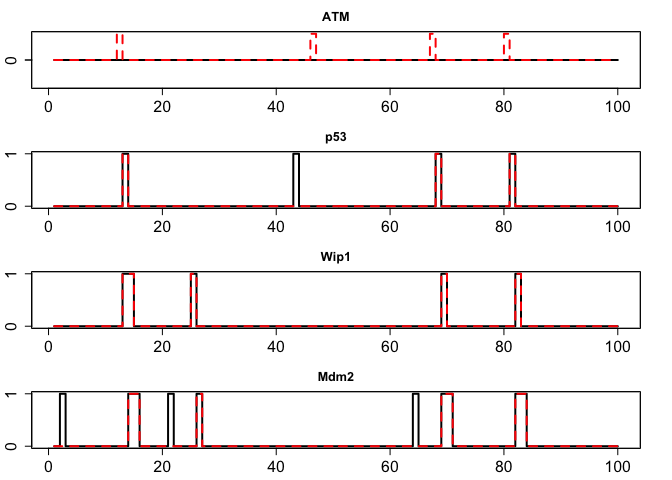
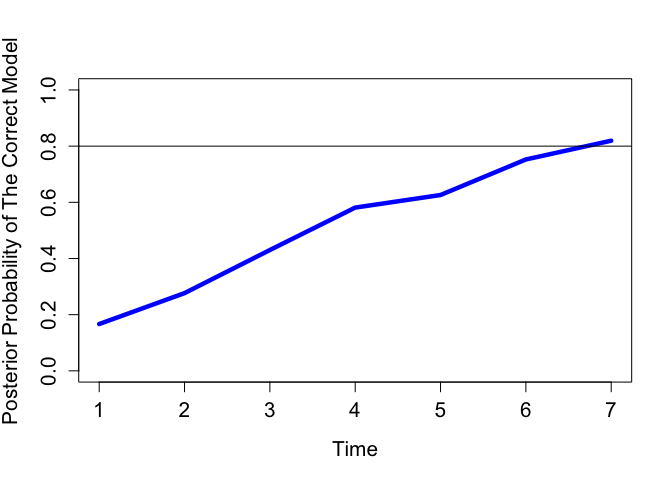

<!-- README.md is generated from README.Rmd. Please edit that file -->
Description
===========

This package seeks to implement optimal estimation of Partially-Observed Boolean Dynamical Systems. The optimal solution is the Boolean Kalman Filtering algorithm, as well as modifications of the same.

Use
===

Deploy the package using:

``` r
library('BoolFilter')
#> Loading required package: Rlab
#> Rlab 2.15.1 attached.
#> 
#> Attaching package: 'Rlab'
#> The following objects are masked from 'package:stats':
#> 
#>     dexp, dgamma, dweibull, pexp, pgamma, pweibull, qexp, qgamma,
#>     qweibull, rexp, rgamma, rweibull
#> The following object is masked from 'package:datasets':
#> 
#>     precip
#> Loading required package: BoolNet
```

A few examples of the basic use of the package are shown below:

### Data Generation, Filtering, and visualization

``` r
data(p53net_DNAdsb0) 

#Simulate data from a Bernoulli observation model
data <- simulateNetwork(p53net_DNAdsb0, n.data = 100, p = 0.02,
                        obsModel = list(type = "Bernoulli",
                                          p = 0.02))
                            
#Derive an estimate of the network using a BKF approach
Results <- BKF(data$Y, p53net_DNAdsb0, .02,
                        obsModel = list(type = "Bernoulli",
                                          p = 0.02))
                        
#View network approximation vs. correct trajectory
plotTrajectory(Results$Xhat,
                labels = p53net_DNAdsb0$genes,
                dataset2 = data$X,
                compare = TRUE)
```



### Model Selection

BoolFilter comes with capibilites for Multiple-Model Adaptive Estimation (citation in vignette), in which model selection and parameter estimation is made possible by implementing a bank Boolean Kalman Filters running in parallel.

``` r
data(p53net_DNAdsb1)

net1 <- p53net_DNAdsb0
net2 <- p53net_DNAdsb1

#define observation model
observation = list(type = 'NB', s = 10.875, mu = 0.01, delta = c(2, 2, 2, 2), phi = c(3, 3, 3, 3))

#simulate data using one of the networks and a given 'p'
data <- simulateNetwork(net1, n.data = 100, p = 0.02, obsModel = observation)
       
#run MMAE to determine model selection and parameter estimation
MMAE(data, net=c("net1","net2"), p=c(0.02,0.1,0.15), threshold=0.8, obsModel = observation)
#>  The infered model is
#>  p = 0.02
#>  Net = net1
#>  The selected model is infered with 8 data.
```



More Information
================

More information can be found in the packages vignette, including more detailed examples and explainations of the individual algorithms included in the package.

References
==========

All references for the above can be found in the vignette references section.
